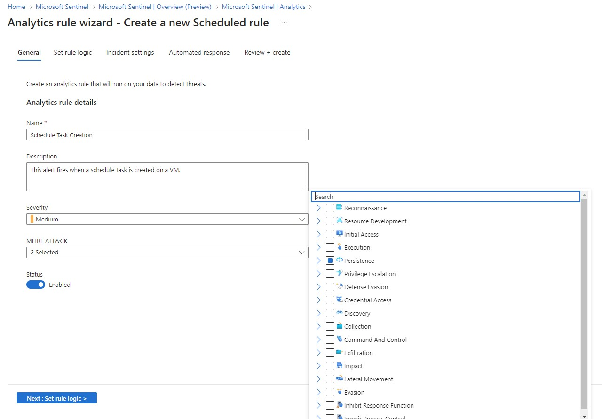
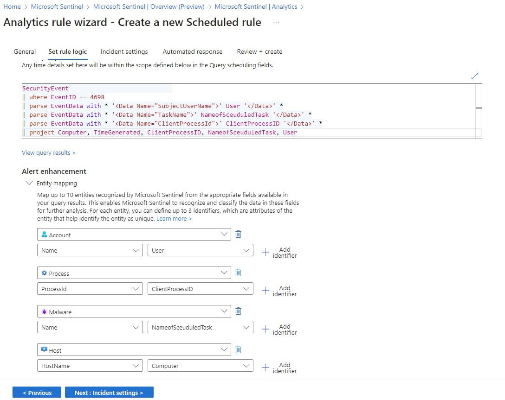
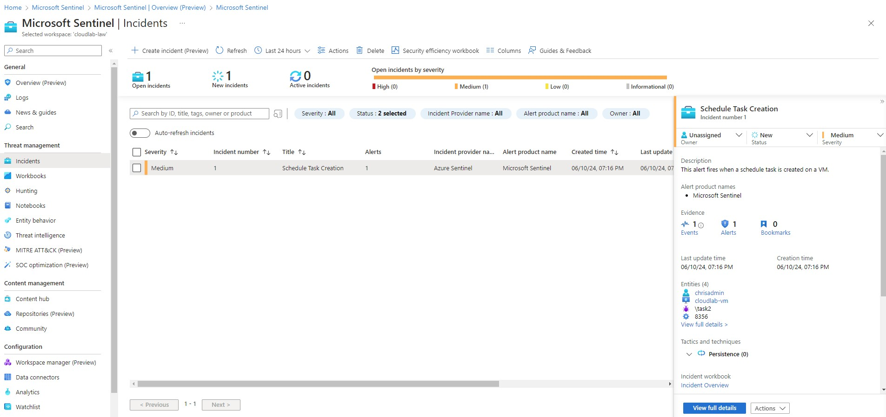

<h1>Azure Cloud Detection Lab</h1>

This lab was created over at [Cyberwox Academy](https://cyberwoxacademy.com/azure-cloud-detection-lab-project/). Thanks for putting together this lab!

<h2>Learning Objectives:</h2>

- Configuration & Deployment of Microsoft Azure virtual machines, Log Analytics Workspaces, and Microsoft Sentinel
- Implement network and virtual machine security best practices (Just-In-Time (JIT) Protocol)
- Utilize Data Connectors to use with Microsoft Sentinel, a cloud-native SIEM (Security Information and Event Management) for analysis
- Understanding Windows Security Event logs
- Using Kusto Query Language (KQL) to query logs
- Write custome analytic rules to detect Microsoft Security Events
- Utilze MITRE ATT&CK to map adversary tactics, techniques, and procedures (TTPs)

<h2>Tools</h2>

<b>The lab is completely cloud-based all done within Microsoft Azure</b>
- Microsoft Azure
- Remote Desktop Protocol

<h2>Overview</h2>

<b>MITRE ATT&CK</b>

In this lab I obeserved the [Mitre att&ack Persistence](https://attack.mitre.org/tactics/TA0003/). Since a schedule taks/job is a technique used that can allow malicious actors in an environment.

<h2>Steps</h2>
  
### Creating a Microsoft Azure account
> Using my new Azure account to use the $200 credit for 30 days that I have remaining.   creating a new azure resource group for this lab

### Creating and delopying a VM
> With this VM were going to enable a security freature called [Just-In-Time (JIT) access](https://learn.microsoft.com/en-us/azure/defender-for-cloud/just-in-time-access-usage?tabs=jit-config-asc%2Cjit-request-asc). 

In the network security group (nsg) for my resource you can see JIT Rule is enable with allow only for my IP (which is blanked out) and below is deny everything else

### Setting up Log Analytics Workspace & deploying Microsoft Sentinel

### Enabling Windows Security Events within the Data Connectors tab
> I enabled this because it allows me to stream all security events from the windows machine into Sentinel

### Logging into the VM
> Checking security events and testing them in the logs in Sentinel to make sure everything is working

### Adding a security policy for the security event to monitor
>Afterwards creating a task schedule event trigger called Malicious Task that would trigger a browser to start.   I did this to generate the EventID 4698 so it can show in the event viewer

### Creating KQL query
>searching for the eventid 4698 that was previously triggered within Sentinel Logs. Also parsing information such as the user, task, process id and host in a KQL query

### Creating an Alaytics Rule with the KQL Query
>This rule will trigger a log to generate whenever the alert occurs.
> This trigger will happens every 5 mins

### Testing out the trigger to to make sure it works
>The VM opened a the Edge browser after I scheduled an event to occur
> Since the log generates every 5 mins I had to wait to see if anything occured

### Checking out the details
> Closing the ticket after assigning it to me with a reason being a FalsePostive

